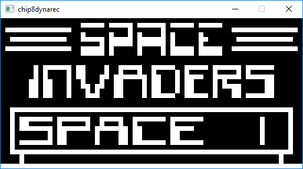

# chip8dynarec
chip8dynarec is an experimental Chip8 emulator using dynamic recompilation for x86-32. It was to learn about Rust and how to write a dynamic recompiler. Some games can be unplayable as it runs too fast though. 
 

